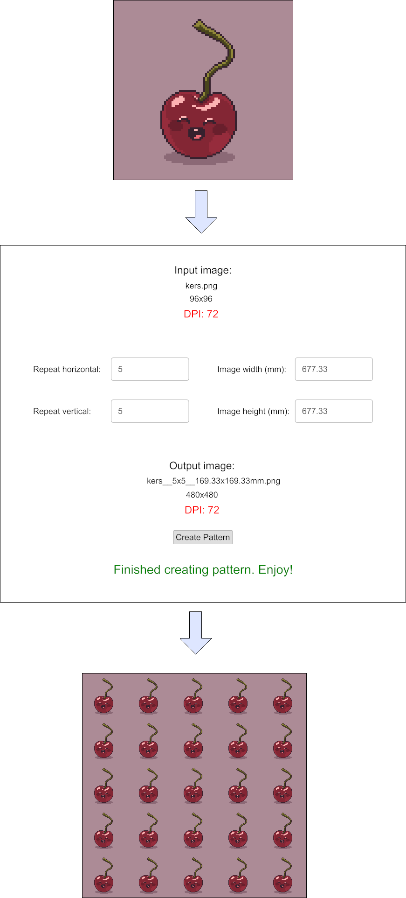

# Repeaty 
 

A tool specialized for print that generates repeating pattern out of input images. It preserves DPI,
ICC Profile, Chroma, Gamma and SRGB information of the original image in the output image.

# Usage

The easiest way to use Repeaty is to download the latest release from the 
[release page](https://github.com/kerskuchen/repeaty/releases) and extract it to a directory 
of our choice.



Additional example output can be found in the `examples` directory.

# Limitations

As of now Repeaty supports only `.png` files. 

# Building it

Assuming we have [Git](https://git-scm.com/) installed first we need to clone and initialize this 
repository via:

```
git clone https://github.com/kerskuchen/repeaty.git
cd repeaty
git submodule update --init --remote
```

Assuming we have [Rust](https://www.rust-lang.org/) installed and can run `cargo` commands we can
build a release version by just running `windows_build_shipping.bat`. This creates a new folder 
named `windows_shipping` which contains the final executable ready to run with all needed
resources.

If we have the [Resource Hacker](http://angusj.com/resourcehacker/) tool in our `%PATH` the 
`windows_build_shipping.bat` script will also set a launcher icon and version information for our 
executable.

# Development

We can build a debug version by running the usual `cargo build` command. The 
[Rust](https://www.rust-lang.org/) website has good information about how to start development 
with Rust.

For development it is a good idea to check out the `cottontail` submodule on the master branch via

```
cd cottontail
git checkout master
```

That will make sure that we don't accidentally commit something to `cottontail` in the 
detached `HEAD` state. We need to be cautious though as this will not automatically checkout the 
latest version of `cottontail`.

If we want to update `cottontail` to its latest version on master we can just run the 
`git_update_cottontail.bat` script.
